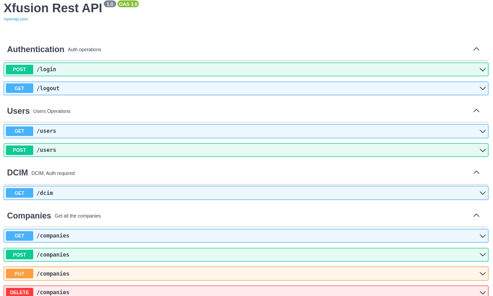

# Xfusion

if using ubuntu and deploy into the production need to run the following commands

``` bash
sudo apt update -y
sudo apt install python3-pip apache2-dev apache2
cd /opt
git clone https://github.com/Vortexdude/Xfusion
cd Xfusion
git checkout new-practice
source venv/bin/activate
pip3 install -r requirements.txt
mod_wsgi-express start-server --log-to-terminal --startup-log --user www-data


```
#### Sample 


